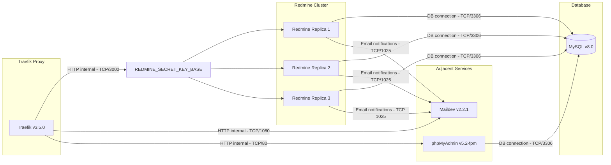
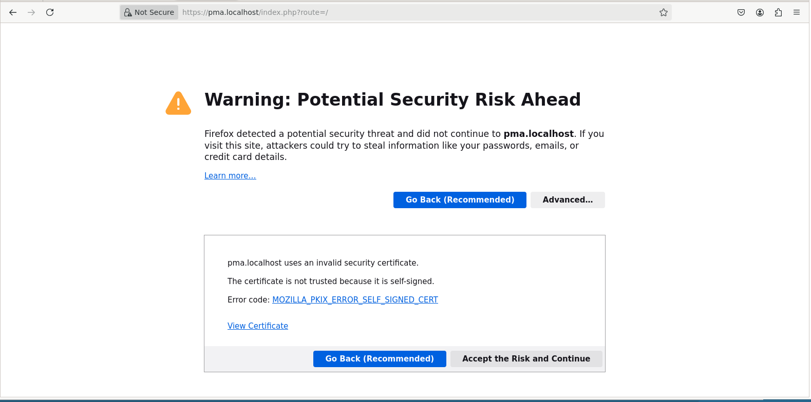

## 008 Fundamentos de contenedores - Actividad Integradora (Mikroways)

Este proyecto tiene como objetivo desplegar un entorno compuesto por **Redmine** escalado a múltiples réplicas, detrás de un **balanceador de carga (Traefik)**, junto con servicios adicionales como **Maildev** y **phpMyAdmin**. 



### Objetivos
- Correr Redmine con más de una réplica.
- Resolver el manejo de sesiones al tener múltiples instancias de Redmine.
- Colocar un **load balancer** (Traefik) delante de los servicios.
- Exponer a través de Traefik:
  - Redmine
  - Maildev
  - phpMyAdmin
- Configurar el acceso por HTTPS (con certificados auto-firmados)
- Utilizar dominios `.localhost` basada en la resolución de nombres que proporciona [systemd-resolved](https://man.archlinux.org/man/systemd-resolved.8)

### Servicios

El `docker-compose.yml` incluye:

- **Redmine** `v6.0.6`: desplegado con 3 réplicas, configurable desde la configuración del compose
- **MySQL** `v8.0`: base de datos para Redmine.  
- **Maildev** `v2.2.1`: para pruebas de correo.  
- **phpMyAdmin** `v5.2-fpm`: herramienta gráfica para la administración de la base de datos  
- **Traefik** `v3.5.0`: balanceador de carga y proxy inverso escrito en Go, configurado para integrarse con Docker.

### Archivos de importancia

- `docker-compose.yml`: definición de los servicios.
- `Dockerfile`: agrega configuración personalizada a Redmine.
- `traefik.yml`: configuración de Traefik.
- `config/configuration.yml`: configuración de Redmine para manejo de sesiones.

### Uso

1. Clonar este repositorio.
2. Generamos las variables necesarias para los servicios 
	 ``` sh
	 openssl rand -hex 64 > .secrets/redmine_secret_key_base
	 echo 'superdbpassword' > .secrets/mysql_root_password
	 ```
3. Ejecutamos los servicios

	```bash
   docker compose up -d --build
   ```

Luego de iniciado los servicios, se pueden acceder a las siguientes URLs:
- Panel de administración de Traefik: `http://localhost:7070`
- Redmine (detras de nginx): `https://redmine.localhost`
- phpMyAdmin: `https://pma.localhost`
- Maildev: `https://maildev.localhost`


### Certificados auto-firmados
Los servicios HTTPS usan **certificados auto-firmados**, por lo que los navegadores muestran advertencias de seguridad al acceder a `https://redmine.localhost`, `https://pma.localhost` o `https://maildev.localhost`. Para continuar, aceptar la excepción de seguridad del navegador. 




